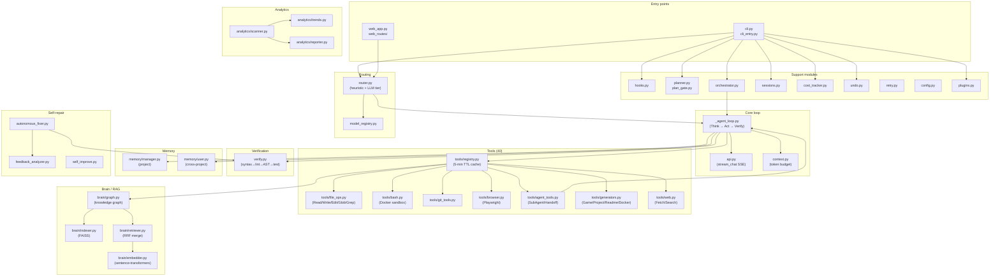

# LuckyD Code — Module Architecture

> For the full narrative walkthrough see **[docs/architecture.md](docs/architecture.md)**.

---

## Module dependency diagram

---

## Layer summary

| Layer | Modules | Role |
|-------|---------|------|
| **Entry** | `cli.py`, `web_app.py`, `web_routes/` | User-facing surfaces — terminal and browser |
| **Routing** | `router.py`, `model_registry.py` | Classify prompt complexity → select model tier |
| **Core loop** | `_agent_loop.py`, `api.py`, `context.py` | Think → Act → Verify agentic harness |
| **Tools** | `tools/` (40 tools, cached registry) | File ops, shell, git, web, browser, generators |
| **Verification** | `verify.py` | Post-write syntax + lint + AST + test gate |
| **Brain / RAG** | `brain/` | Knowledge graph + vector search + BM25 |
| **Memory** | `memory/` | Project and cross-project persistent memory |
| **Analytics** | `analytics/` | Code health, smell detection, trend tracking |
| **Self-repair** | `autonomous_fixer.py`, `feedback_analyzer.py` | Diagnose → patch → validate → PR |
| **Support** | `hooks.py`, `planner.py`, `sessions.py`, etc. | Lifecycle hooks, planning, sessions, cost |

---

## Key design decisions

**Single shared agent loop** — `cli.py`, `web_app.py`, `SubAgent`, and `AgentHandoff` all call the same `run_agent_loop()` in `_agent_loop.py`. Bug fixes and improvements propagate to every agentic path automatically.

**Parallel read / sequential write** — The tool executor runs read-only tools (`Read`, `Glob`, `Grep`, …) concurrently in a `ThreadPoolExecutor` (up to 4 workers). Write-conflict tools (`Write`, `Edit`, `Bash`, `GitCommit`, …) always run sequentially to prevent race conditions.

**Stuck-loop detection** — Each tool-call batch is hashed. If the same hash appears 3 times in a row the loop breaks and asks the model to explain what is blocking it, preventing infinite tool cycles.

**Mid-loop model escalation** — If the verification pipeline keeps failing, the loop promotes to the next model tier (`deepseek-v4-flash` → `deepseek-v4-pro`) for recovery turns, then returns to the original tier.

**Git worktree isolation** — The autonomous fixer applies diffs in a `git worktree add` temporary directory. The user's working copy is never touched.
